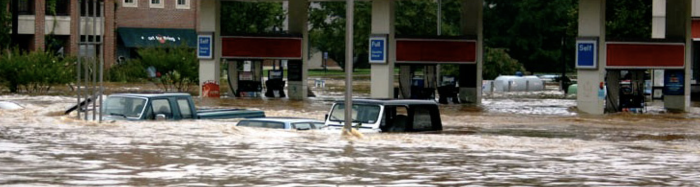

<style>
title {text-align: left}
body {text-align: justify}
p {text-indent: 2rem;}
p {line-height: 2em;}
body{
  font-size: 12pt;
}
</style>


\newpage
\tableofcontents 
\newpage
\listoftables 
\newpage
\listoffigures 
\newpage


```{r , message = FALSE, warning = FALSE, include = FALSE, results = FALSE}
# Set your working directory
getwd()
#setwd()

#load packages
library(lubridate)
library(ggplot2)
library(dplyr)
library(tidyverse)
library(zoo)
library(trend)
library(readr)
library(Kendall)
library(tseries)
library(dataRetrieval)
library(lubridate)
library(lfstat) 
#install.packages("kableExtra")
library(kableExtra)
library(cowplot)
#install.packages("viridis")
library(viridis)
#install.packages("patchwork")
library(patchwork)


# Set your ggplot theme
mytheme <- theme_classic(base_size = 14) +
  theme(axis.text = element_text(color = "black"))
theme_set(mytheme)

options(scipen = 999) # this eliminate scientific notation
```

```{r DISCHARGE - readingindata, message = FALSE, warning = FALSE, include = FALSE, results = FALSE}
# Load your datasets
AshDischarge <- readNWISdv(siteNumbers = "03451500",
                     parameterCd = "00060", # discharge (ft3/s)
                     startDate = "1963-10-01", 
                     endDate = "2021-12-31") #complete water years

names(AshDischarge)[4:5] <- c("Discharge", "Approval.Code")

attr(AshDischarge, "variableInfo")
attr(AshDischarge, "siteInfo")

#discharge_plot<-ggplot(AshDischarge, aes(x = Date, y = Discharge)) +
  #geom_line() +
  #labs(x = "Year", y = "Discharge (cfs)")
```

```{r DISCHARGE - wrangling discharge data, message = FALSE, warning = FALSE, include = FALSE, results = FALSE}
AshDischarge$Date <- as.Date(AshDischarge$Date, format = "%Y/%d/%m")

class(AshDischarge$Date)

#filtering data for later dates
AshDischarge.late <- AshDischarge %>%
  filter(Date > as.Date("1981-01-01"))

#table for the report
#knitr::kable(head(AshDischarge.late[,1:4]), "simple")

AshDischarge.late<-rename(AshDischarge.late, "Agency Code"=agency_cd, "Site Number"=site_no, "Approval Code"=Approval.Code)

discharge_data_table<-head(AshDischarge.late[,1:4]) %>%
  kbl()  %>%
  kable_styling() %>% 
  add_header_above(c("Asheville USGS Precipitation Data"=4))
discharge_data_table

#plotting discharge
discharge_plot<-ggplot(AshDischarge.late, aes(x = Date, y = Discharge))+
  geom_line()+
  geom_smooth(method = lm)+
  labs(title = "French Broad Discharge Over Time",
       ylab = "Discharge (cfs")+
    theme(plot.title = element_text(hjust = 0.5))
discharge_plot
```

```{r DISCHARGE - timeseries, message = FALSE, warning = FALSE, include = FALSE, results = FALSE}
#time series
AshDischarge.late_ts <- ts(AshDischarge.late$Discharge, start = c(1981,1), frequency = 365)

#decomposition
AshDischarge.late_Decomposed <- stl(AshDischarge.late_ts, s.window = "periodic")

# Visualize the decomposed series. 
plot(AshDischarge.late_Decomposed)

#making a data frame
AshDischarge.late_Components <- as.data.frame(AshDischarge.late_Decomposed$time.series[,1:3])

AshDischarge.late_Components <- mutate(AshDischarge.late_Components,
        Observed = AshDischarge.late$Discharge,     
        Date = AshDischarge.late$Date)

#plotting with trend
discharge_late_trend_plot<-ggplot(AshDischarge.late_Components) +
  geom_line(aes(y = Observed, x = Date),  size = 0.25) +
  geom_line(aes(y = trend, x = Date), color = "#c13d75ff") +
  geom_hline(yintercept = 0, lty = 2) +
  ylab(expression("Discharge (ft"^3*"/s)"))+
  labs(title = "French Broad Discharge with Trend")+
    theme(plot.title = element_text(hjust = 0.5))

#seasonal cycle
discharge_late_seasonal_plot<-ggplot(AshDischarge.late_Components) +
  geom_line(aes(y = Observed, x = Date),  size = 0.25) +
  geom_line(aes(y = seasonal, x = Date), color = "#c13d75ff") +
  geom_hline(yintercept = 0, lty = 2) +
  ylab(expression("Discharge (ft"^3*"/s)"))+
  labs(title = "French Broad Discharge with Seasonal Variation")+
    theme(plot.title = element_text(hjust = 0.5))

AshDischarge_trend1 <- Kendall::SeasonalMannKendall(AshDischarge.late_ts)

AshDischarge_trend1
summary(AshDischarge_trend1)

AshDischarge_trend2 <- trend::smk.test(AshDischarge.late_ts)

# Inspect results
AshDischarge_trend2
summary(AshDischarge_trend2)

AshDischarge_plot <-
ggplot(AshDischarge.late, aes(x = Date, y = Discharge)) +
  geom_line() +
  ylab("Discharge (cfs)") +
  labs(title = "Discharge Trend over Time")+
  geom_smooth(method = lm) +
  theme(plot.title = element_text(hjust = 0.5))
AshDischarge_plot
```

```{r PRECIP - import and wrangle, message = FALSE, warning = FALSE, include = FALSE, results = FALSE}
#read in data set
Asheville_precip_data <- read_csv("../Diamond_Navarro_Von_Turkovich_ENV872_EDA_FinalProject/Precip Data/Data/Raw/Asheville_precip_data.csv") #reading csv was not working - must manually import data set

#formatting date as date
Asheville_precip_data$LocalDateTime <- as.Date(Asheville_precip_data$LocalDateTime, format = "%m/%d/%Y")

#checking date class
class(Asheville_precip_data$LocalDateTime)

Ash_Precip_processed <-
  Asheville_precip_data %>%
  select(LocalDateTime, DataValue)%>%
  mutate(Month = month(LocalDateTime),
         Year = year(LocalDateTime))%>%
  rename(Date = LocalDateTime, Precip.mm = DataValue)

ash_precip_data<-head(Ash_Precip_processed[,1:4]) %>%
  kbl()  %>%
  kable_styling() %>% 
  add_header_above(c("Asheville NOAA Precipitation Data"=4))

#Saving new processed data to processed folder
write.csv(Ash_Precip_processed, file = "../Diamond_Navarro_Von_Turkovich_ENV872_EDA_FinalProject/Precip Data/Data/Processed/Ash_Precip_processed.csv")
```

```{r PRECEIP -  data exploration, message = FALSE, warning = FALSE, include = FALSE, results = FALSE}

precip_plot<-ggplot(Ash_Precip_processed, aes(x = Date, y = Precip.mm))+
  geom_line()+
  ylim(0,120)+
  geom_smooth(method = lm)+
  labs(title = "Asheville Daily Precipitation (mm) Over Time",
       xlab = "Daily Precipitation (mm)")+
    theme(plot.title = element_text(hjust = 0.5))
precip_plot
```

```{r PRECIP - Looking at Significant Precipitation Events for Asheville, message = FALSE, warning = FALSE, include = FALSE, results = FALSE}
#pulling in significant rainfall in millimeters
Significant_rainfall <- read.csv("../Diamond_Navarro_Von_Turkovich_ENV872_EDA_FinalProject/Precip Data/Data/Raw/PF_Depth_Metric_PDS.csv")

#creating table for significant precipitation in mm 
#knitr::kable(Significant_rainfall, caption = "Significant Precipitation Events for Asheville in mm", 
             #col.names = c("Duration", "1 year", "2 year", "5 year", "10 year", "25 year", "50 year", "100 year", "200 year", "500 year", "1000 year"))

sig_rainfall_table<-Significant_rainfall %>%
  kbl(col.names = c("Duration", "1 year", "2 year", "5 year", "10 year", "25 year", "50 year", "100 year", "200 year", "500 year", "1000 year"))  %>%
  kable_styling()%>% 
  add_header_above(c("Significant Rainfall in Asheville, NC"=11))

sig_rainfall_table
```

```{r PRECIP - Graphing significant precipitation events in Asheville, message = FALSE, warning = FALSE, include = FALSE, results = FALSE}
#1 year rain event 
one_year.df <- 
  Ash_Precip_processed %>%
  filter(Precip.mm > 55)

one_yr_point<-ggplot(one_year.df, aes(x = Year, y = Precip.mm, color = Precip.mm))+
  geom_point()+
  scale_color_viridis() +
  labs(Title = "Rainfall Events over 1-year Threshold",
       y = "Precipitation in mm", 
       x = "Date")+
    xlim(1981, 2021)+
      ylim(60, 100)+
      theme(legend.position="none")+
  theme(axis.text.x = element_text(angle = 45, hjust=1), axis.title=element_text(size=12))

one_yr_leg<-ggplot(one_year.df, aes(x = Year, y = Precip.mm, color = Precip.mm))+
  geom_point()+
  scale_color_viridis() +
  labs(Title = "Rainfall Events over 1-year Threshold",
       y = "Precipitation in mm", 
       x = "Date")+
    xlim(1981, 2021)+
      ylim(60, 110)+
  theme(legend.position = "top", legend.direction="horizontal", legend.key.size = unit(.3,'cm'), legend.title = element_text(size=10), #change legend title font size
        legend.text = element_text(size=8)) #change legend text font size)
  
one_yr_hist<-ggplot(one_year.df, aes(x = Year))+
  geom_histogram(bins = 8, color = "black", fill = "darkblue", alpha = .9)+
    labs(Title = "Frequency of Rainfall Events over 1-year Threshold",
       y = "Frequency of Events", 
       x = "Date")+
   xlim(1980, 2021)+
  ylim(0,10)+
  theme(axis.text.x = element_text(angle = 45, hjust=1), axis.title=element_text(size=12))


#2 year rain event 
two_year.df <- 
  Ash_Precip_processed %>%
  filter(Precip.mm > 66)

two_yr_point<-ggplot(two_year.df, aes(x = Year, y = Precip.mm, color = Precip.mm))+
  geom_point()+
    scale_color_viridis() +
  labs(Title = "Rainfall Events over 2-year Threshold",
       x = "Date")+
    xlim(1981, 2021)+
      ylim(60, 110)+
      theme(legend.position="none")+
  theme(axis.text.x = element_text(angle = 45, hjust=1), axis.title.y = element_blank())

two_yr_hist<-ggplot(two_year.df, aes(x = Year))+
  geom_histogram(bins = 8, color = "black", fill = "darkblue", alpha = .9)+
  labs(Title = "Frequency of Rainfall Events over 2-year Threshold",
       y = "Frequency of Events", 
       x = "Date")+
   xlim(1980, 2021)+
  ylim(0,10)+
  theme(axis.text.x = element_text(angle = 45, hjust=1), axis.title.y = element_blank())

#5 year rain event 
five_year.df <- 
  Ash_Precip_processed %>%
  filter(Precip.mm > 82)

five_yr_point<-ggplot(five_year.df, aes(x = Year, y = Precip.mm, color = Precip.mm))+
  geom_point()+
    scale_color_viridis() +
    labs(Title = "Rainfall Events over 5-year Threshold",
       x = "Date")+
    xlim(1981, 2021)+
    ylim(60, 110)+
      theme(legend.position="none")+
  theme(axis.text.x = element_text(angle = 45, hjust=1), axis.title.y = element_blank())

five_yr_hist<-ggplot(five_year.df, aes(x = Year))+
  geom_histogram(bins = 8, fill = "darkblue", color = "black", alpha = .9)+
    labs(Title = "Frequency of Rainfall Events over 5-year Threshold",
       x = "Date")+
  xlim(1980, 2021)+
  ylim(0,10)+
  theme(axis.text.x = element_text(angle = 45, hjust=1), axis.title.y = element_blank())

leg = get_legend(one_yr_leg)

title <- ggdraw() + 
  draw_label(
    "Frequency & Magnitude of Extreme Precipitation Events",
    fontface = 'bold',
    x = 0,
    hjust = 0
  ) +
  theme(
    # add margin on the left of the drawing canvas,
    # so title is aligned with left edge of first plot
    plot.margin = margin(0, 0, 0, 7))

plot_grid<-plot_grid(one_yr_point, two_yr_point, five_yr_point, one_yr_hist, two_yr_hist, five_yr_hist,
          labels = c("One Year Event", "Two Year Event", "Three Year Event"),
          ncol = 3, nrow = 2, align = "hv", rel_widths = c(2,2,2,.5))

precip_event_freq <-plot_grid(
  title, plot_grid, leg,
  ncol = 1,
  # rel_heights values control vertical title margins
  rel_heights = c(0.1, 1.5, 0.1))

precip_event_freq 
```

```{r DISHCHARGE + PRECIP - linear model, message = FALSE, warning = FALSE, include = FALSE, results = FALSE}
#linear model wrangling 
combind.data <- left_join(Ash_Precip_processed, AshDischarge.late)

filtered.data <- combind.data %>% 
  filter(Precip.mm > 0) %>% 
  select(Date:Year, Discharge)

#second table to show the dataset. 
#filtered.data<-rename(filtered.data, "Precipitation(mm)"=Precip.mm)

combined_head_table<-head(filtered.data[,1:5]) %>%
  kbl()  %>%
  kable_styling() %>% 
  add_header_above(c("Discharge and Precipitation Combined Data"=5))

DischargebyPrecip <- 
  ggplot(filtered.data, aes(x = Precip.mm, y = Discharge)) +
  geom_point() +
  geom_smooth(method = "lm") +
  ylab("Discharge (cfs)") +
  xlab("Precipitation (mm)")
print(DischargebyPrecip)

Discharge.regression <- lm(data = filtered.data, Discharge ~ Precip.mm)
summary(Discharge.regression)

#looking at the plots
par(mfrow = c(2,2), mar=c(4,4,4,4))
plot(Discharge.regression)

Discharge.Precip.Plot<- 
  ggplot(filtered.data, aes(x = Precip.mm, y = Discharge)) +
  geom_point(alpha = 0.5) +
  geom_smooth(method = "lm", se = FALSE, formula = y ~ x) +
  ylab("Discharge (cfs)") +
  xlab("Precipitation (mm)") +
  labs(title = "Discharge by Precipitation",
       caption = "Figure")+
    theme(plot.title = element_text(hjust = 0.5),
        plot.caption = element_text(hjust = 0))
print(Discharge.Precip.Plot) 
```

```{r combined try, message = FALSE, warning = FALSE, include = FALSE, results = FALSE}
#combined_line<-ggplot()+
  #geom_line(combined_head_table, aes(x = Year, y = Precip.mm, color = Precip.mm))+
  #scale_color_viridis() +
  #labs(Title = "Rainfall Events over 1-year Threshold",
     #  y = "Precipitation in mm", 
    #   x = "Date")+
    #xlim(1981, 2021)+
     # ylim(60, 110)+
  #theme(legend.position = "top", legend.direction="horizontal", legend.key.size = unit(.3,'cm'), legend.title = element_text(size=10), #change legend title font size
        #legend.text = element_text(size=8)) #change legend text font size)
```

## **Rationale and Research Questions**
  
The earths climate is changing and is resulting higher seas, new weather patterns and stronger storms (Floodfactor, 2022). The warming atmosphere is causeing more evaporation, which leads to more water availble for precipitation (Floodfactor, 2022). This is resulting in more extreme weather events. Both the frequency and magnitude of weather events is creasing world wide. North Carolina has not be spared this new weather patterns. Intense rains in North Carolina have been causing flooding. Devastating flooding as occurred recently in the mountainous, western portion of the state. Flooding in Asheville, located in the western North Carolina along the French Broad River resulted in two fatalities in the fall of 2022 (Harris, 2021). The the orographic rains that this mountainous region is prone along with the topography of the terrain to contributes to this areas vulnerability to flooding. 

In light of the recent flooding in Asheville we are interested in exploring if flood risk in Asheville, NC is increasing over time. To do this we will analyze both precipitation data in Asheville as well as river discharge data on the French Broad River. For data set we will look at NOAA precipitation data, and USGS stream gage data. We will be asking the following questions:

1. Is discharge increasing over time?

2. What trends exist in the discharge data over time?

3. Is precipitation increasing over time?

4. Are the frequency of significant precipitation events increasing over time?

5. Is the magnitude of significant rainfall events increasing over time?

6. Does precipitation have a significant effect on rain fall?
  
```{r , message = FALSE, warning = FALSE, echo = FALSE, results = TRUE, fig.cap="Flooding in Asheville.", out.width = '100%'}

```

  
\newpage
## **Dataset Information**

### **Discharge Data**

To understand the discharge in Asheville, North Carolina we used data from the United States Geographical Survey’s (USGS) National Water Information System (NWIS). We were able to pull this dataset into R using the dataretrieval function which lets you simply put the specific USGS code for the area we were interested in looking more closely at, ours being the French Broad River. We chose stream gauge station 03451500 which is close to the city center of Asheville. There were multiple parameters available for this site including discharge, precipitation, pH, stream level, etc. By identifying the USGS code as well as the specific codes for the parameters we wanted to look at (i.e., discharge data) we were able to pull in corresponding data for the last 60 years. Because discharge data is recorded daily, we had records of every day from 1963 to 2021. The pulled dataset included the agency (USGS), the site number, the date, and the amount of discharge in cubic feet per second. 

Because we were able to pull in exactly which columns we wanted, there was not much to wrangle for this specific dataset. We did however decide that for all the parameters we were looking at that we would only include the last forty years (1981-2021). In order to do this, we filtered the dataset to only include those specific years. We also used the lubridate package to change the date column to have a date class format.

  
```{r, message = FALSE, warning = FALSE, echo = FALSE, results = TRUE, tab.cap="French Broad River, Asheville USGS data table variables."}
discharge_data_table
```
  
### **Precipitation Data**

```{r, message = FALSE, warning = FALSE, echo = FALSE, results = TRUE, fig.cap="Asheville NOAA precipitation data table variables"}
ash_precip_data
```
  

### **Combined Data**

For our linear model dataset, we combined both the discharge and the precipitation datasets into one using the leftjoin function. Doing so, we had both the date, the amount of discharge in cubic feet per second, and the precipitation in milliliters from the past 40 years. For some reason, some of the precipitation entries were negative numbers so we filtered to make sure the final dataset included only precipitation values greater than 0 milliliters. 

```{r, message = FALSE, warning = FALSE, echo = FALSE, results = TRUE, fig.cap="Combined precipitation and discharge data."}
combined_head_table
```
  

\newpage
## **Exploratory Analysis**

### **Discharge Exploration**

In order to better understand the flood risk in Asheville, North Carolina, we were interested in understanding the daily discharge data throughout time as well as the overall relationship between discharge and precipitation. To measure this we wanted to run a time series of the discharge data as well as a seasonal decomposition to understand both the seasonality of the data and the trend throughout time. We also wanted to understand what in fact was the trend over time and how this information can inform the flood risk for Asheville. 

As for the relationship between discharge and precipitation, we felt the best way to see this was through a general linear model. By looking at the dependence that discharge may have over precipitation, we were confident that this too would help us to answer our original research question of how these two parameters and the relationship between them have impacted the flood risk over time. 

```{r, message = FALSE, warning = FALSE, echo = FALSE, results = TRUE, fig.cap="French Broad Discharge over time."}
discharge_plot
```
  

### **Precipitation Exploration**

```{r, message = FALSE, warning = FALSE, echo = FALSE, results = TRUE, fig.cap="Asheville precipitation over time."}
precip_plot
```


\newpage
## **Analysis**

Through our analysis we became more familiar with the data and the relationship between precipitation and discharge in Asheville.

The following analysis can be divided into three parts:

1. How has discharge changed over time?

2. How has precipitation changed over time?

3. What is the relationship of discharge to precipitaion?

### **Discharge Analysis**

To first look at the trends of discharge data over time, we ran a simple timeseries that began on January 1, 1981, and ran through December 31, 2021, with a frequency of 365 days. Because this data had a seasonal component, we examined the decomposition of this timeseries data to get a better visual of the trend and seasonality throughout time. 

```{r, message = FALSE, warning = FALSE, echo = FALSE, results = TRUE, fig.cap="French Broad River discharge, time series decompostion."}
plot(AshDischarge.late_Decomposed)
```

After this, we created an “Observed” column in the dataframe to show the discharge with the corresponding date so we could visualize both the trend and the seasonality throughout time.

```{r, message = FALSE, warning = FALSE, echo = FALSE, results = TRUE, fig.cap = "French Broad River Discharge, trend over time with trend line."}
print(discharge_late_trend_plot)
```

```{r, message = FALSE, warning = FALSE, echo = FALSE, results = TRUE, fig.cap = "French Broad River Discharge, trend over time with seasonal variation line."}
print(discharge_late_seasonal_plot)
```
  
Lastly, we used the Seasonal Mann-Kendall test to know whether the trend over time was positive or negative. Our results of this test showed that we could reject the null hypothesis that there is no trend in the seasonal data and that there is a positive trend over time in the discharge data (pvalue > 0.05, tau = 0.0622). The final plot of the trend can be seen below.

```{r, message = FALSE, warning = FALSE, echo = FALSE, results = TRUE, fig.cap = "French Broad River Discharge, trend over time with line of best fit."}
print(AshDischarge_plot)
```
\newpage

### **Precipitation Analysis**

```{r, message = FALSE, warning = FALSE, echo = FALSE, results = TRUE, fig.cap="Estimated magnitude of precipitation events in mm in Asheville, NC at significant intervals."}
sig_rainfall_table
```
  
```{r, message = FALSE, warning = FALSE, echo = FALSE, results = TRUE, fig.cap="Frequency and magnitude of precipitation events over time."}
precip_event_freq
```
  
\newpage
### **Discharge and Precitpitaion Relationship**

In our next analysis, we looked more at the relationship between discharge and the precipitation data. As mentioned previously, we used a general linear model to look more closely at this relationship. Our results of this linear model regression show that there was in fact a significant relationship between the two variables, and we were confidently able to reject the null hypothesis that there was no relationship between discharge and precipitation. It can be seen below in the QQ-Plot that this data is not really normally distributed and that it would be advantageous to potentially log-transform the data to view the relationship better

```{r, message = FALSE, warning = FALSE, echo = FALSE, results = TRUE, fig.cap = "French Broad River discharge and Asheville precipitation, linear model results.", fig.align="center"}
par(mfrow = c(2,2), mar=c(4,4,4,4))
plot(Discharge.regression)
```
  
Looking closer at the summary table, we were able to determine that this was a positive relationship and that for every one unit of precipitation, discharge increased by 48.3 cubic feet per second (p-value < 0.05, F-statistic = 324.3 on 1 and 525 degrees of freedom, R^2 = 0.05805). Our R-squared value however only explained around 6% of the variability and this could be due to the fact that discharge and precipitation isn’t usually modelled linearly which could account for the lower R^2 and could be something to investigate further. A detailed visualization of the relationship can be seen in the plot below.
  
```{r, message = FALSE, warning = FALSE, echo = FALSE, results = TRUE, fig.cap = "French Broad River discharge by Asheville precipitation, linear relationship."}
print(Discharge.Precip.Plot)
```
  
Both of these analyses can be helpful to inform our original research question of how these variables and the relationship between them have changed over time and will be discussed at greater length in our summary and conclusion sections. 

\newpage
## **Summary and Conclusions**

Summarize your major findings from your analyses in a few paragraphs. What conclusions do you draw from your findings? Relate your findings back to the original research questions and rationale.

Through our analysis we observed the how precipitation and river discharge are changing in Asheville over time. Even though there may be an increase of flooding events that does not always correlate to an increases in precipitation and discharge as large events could be balanced by period of lower than normal rainfall. Our analysis did allow us to answer our research questions and gain a better understand of hydrologic events in Asheville in the past 40 years. 

Through our analysis of discharge in the French Broad river we were able to answer our first research question of what trends exist in dishcarge data over time. We found that athough small, there is indeed an increase in overall discharge moving through the Asheville in the past 40 years___. After decomposing our time series analysis we found that the trend of the overall data was not clearly increasing. We did however find that there was a slight visual correspondence between the seasonal data and the overall shape of the time series plot. This finding was confirmed with the results of the Seasonal Man Kendall test. Our results of this test showed that we could reject the null hypothesis that there is no trend in the seasonal data and that there is a positive trend over time in the discharge data, answering our second research question. 

Analysis of the precipitation data in Asheville resulted in a result of a positive increase in precipitation over time, answering research questions number three ___. Additionally, we looked at the 24 hour rain event occurring every year, two years and five years in Asheville. We found that over the past 40 years the size of the 24 hour rain event was increasing for each event interval (1, 2, and 5 years). Of the highest interval event, five year event, this size event has been increasing in frequently over time. This analysis allowed us to answer our fourth and firth research questions. We can conclude that the frequency and intensity of storms is increasing over time in Asheville.

A comparisson of the relationship on precipitation on river discharge resulted in a significant result answering our sixth research question. As one would suspect, precipitation has a positive effect on river discharge. This result provides further evidence that the increases measured in precipitation event magnitude and frequency will also have an increase in magnitude and frequency of high discharge in the river. 

The changing climate puts to the test the systems that have been built around data from the past. Acknowledging these creases in hyrodologic activity which lead to an increase in flood risk requires municipalities to assess their current storm water system and flood plain boundaries. Awareness of the chanding conditions is necessary for communities to be able to adapt and build resilience to climate risks in their areas. 


```{r , message = FALSE, warning = FALSE, echo = FALSE, results = TRUE, fig.cap="Flooding in Asheville.", out.width = '75%', fig.align="center"}

```


\newpage
## **References:**

Harris, S. (2021, August 20). Asheville and Buncombe flooding related road, park closures, Help Line. The Asheville Citizen Times. Retrieved April 16, 2022, from https://www.citizen-times.com/story/news/2021/08/20/asheville-buncombe-nc-area-flooding-road-park-closures-help-line/8211528002/ 

FloodFactor (2022). Asheville, North Carolina. Flood Factor. https://floodfactor.com/city/asheville-northcarolina/3702140_fsid

Figure 1: Photo credit: https://www.ashevillenc.gov/department/public-works/stormwater-services-utility/flood-information/

Figure 2: Photo credit: Amy Westmoreland
